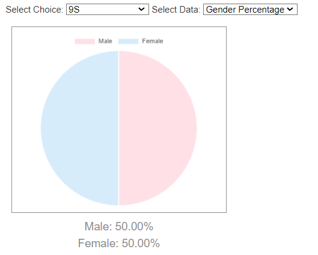
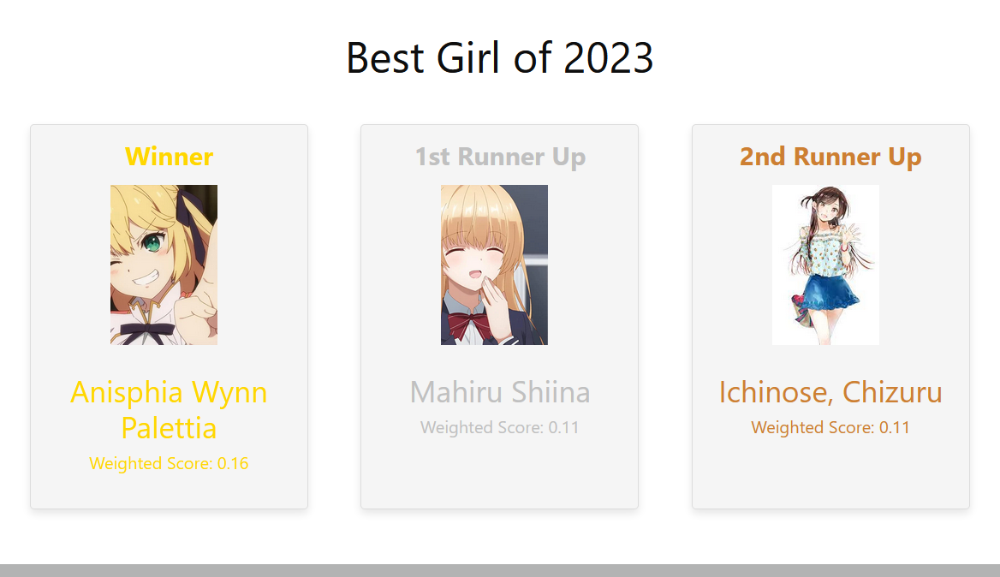

# Anime Voting System

## Project Description

The Anime Voting System is a web application built using the Django framework. It allows users to vote for their favorite anime each season. The system also includes an admin panel with detailed statistics and charts to review voting stats based on different labels such as gender, age, and region. Admins can see anime rankings based on categories and seasons. The anime lists are updated manually every season (4 seasons per year), but users can only vote in the current season and view past season votes.

## Table of Contents

- [Features](#features)
- [Screenshots](#screenshots)
- [Usage](#usage)
- [Technologies Used](#technologies-used)

## Features

- **User Registration and Authentication**: Secure login and registration system.
- **Voting System**: Users can vote for their favorite anime in the current season.
- **Seasonal Updates**: Admins manually update the anime lists every season.
- **View Past Votes**: Users can view votes from past seasons.
- **Admin Panel**: Detailed statistics and charts for reviewing voting stats.
- **Voting Stats**: Breakdown by gender, age, and region.
- **Anime Rankings**: Based on categories and seasons.

## Screenshots

### Voting Page

### Bar Graph

### Chart

### Sample Rankings

### Season Statistics

## Usage

1. **Register or Login**
   - Register as a new user or log in with existing credentials.

2. **Vote for Anime**
   - Browse the current season's anime list and cast your vote.

3. **View Past Votes**
   - View the results of past season votes.

4. **Admin Functions**
   - Log in to the admin panel to manage anime lists and view detailed statistics and charts.

## Technologies Used

- **Django**: Web framework for the backend.
- **SQLite**: Database for storing user, anime, and voting information.
- **Chart.js**: Library for displaying statistics and charts.
- **HTML/CSS/JavaScript**: Frontend technologies.
